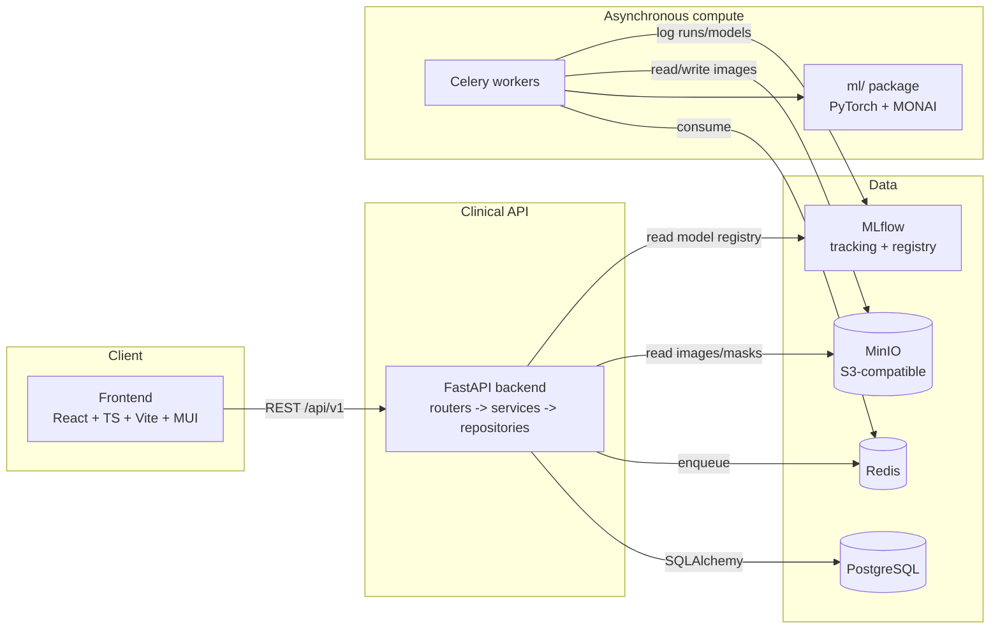

# Architecture

## Overview

## Layering rules

- **Frontend** never talks to Postgres, Redis, MinIO, or MLflow directly — only to the versioned
  REST API (`/api/v1`).
- **Backend controllers (routers)** stay thin: request/response mapping and dependency wiring
  only. Business logic lives in `app/services/`; data access lives in `app/repositories/`.
  This is enforced by code review, not tooling, in the MVP.
- **`ml/`** contains no FastAPI or Celery imports — it exposes plain Python functions/classes with
  stable input/output contracts (numpy arrays, dataclasses), so it can be unit-tested and reused
  outside the web stack (e.g. from a notebook).
- **Celery workers** are the only place that imports both the API's data-access layer (to read job
  parameters, write results) and the `ml/` package. This keeps heavyweight ML dependencies
  (PyTorch, MONAI) out of the request/response path entirely — an inference or training request
  never blocks an HTTP worker.
- **MLflow** is the single source of truth for training runs, metrics, and model artifacts.
  `ModelVersion` rows in Postgres reference an MLflow run/model URI rather than duplicating
  artifact storage.

## Why these boundaries

A segmentation or training job can run for minutes; putting it behind a synchronous HTTP request
would tie up API workers and time out browsers. Everything long-running goes through Celery, and
the frontend polls/subscribes to a job's status via the API instead of waiting on the connection.

## Monorepo layout

See the top-level [`README.md`](../README.md#repository-layout).

## Data model

Entities and their required common columns (UUID, `created_at`, `updated_at`, soft-delete where
applicable) are defined incrementally as each phase introduces them — see
[`docs/data-dictionary.md`](data-dictionary.md) for the current state and the full target entity
list from the project spec.
